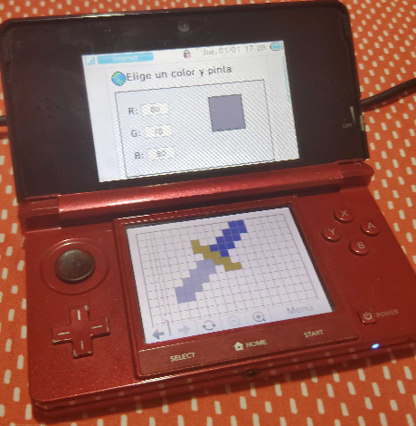

# 3DSPlace
Este es un proyecto para 3DS enfocado en que las personas puedan dibujar en sus consolas, en todas las variantes y versiones de la 3DS.

Solo se necesita el navegador por defecto de la consola 3DS. Una vez dentro del navegador, ve a:
<code>https://alanleiva153.github.io/3DS/
</code>
¡y listo!

Elige un color y… ¡a pintar! ^-^

[3DSPlace \/](https://alanleiva153.github.io/3DS/)

## 1.1.0
+ No online :(
